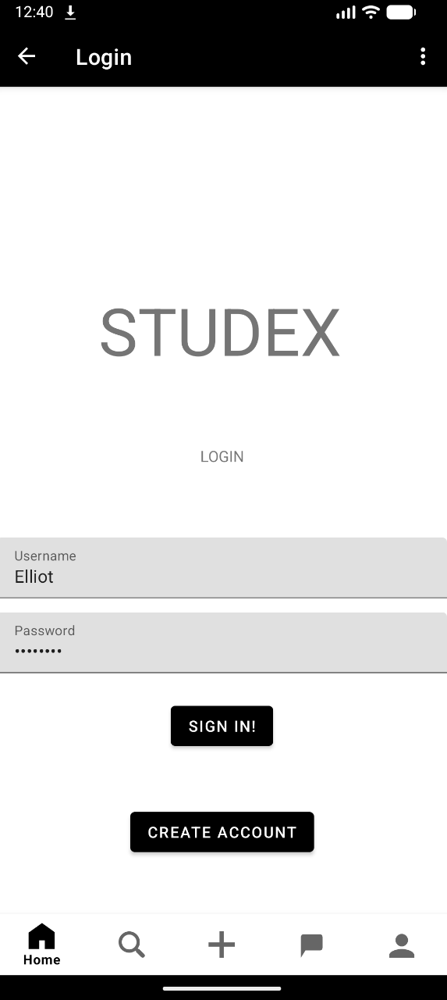
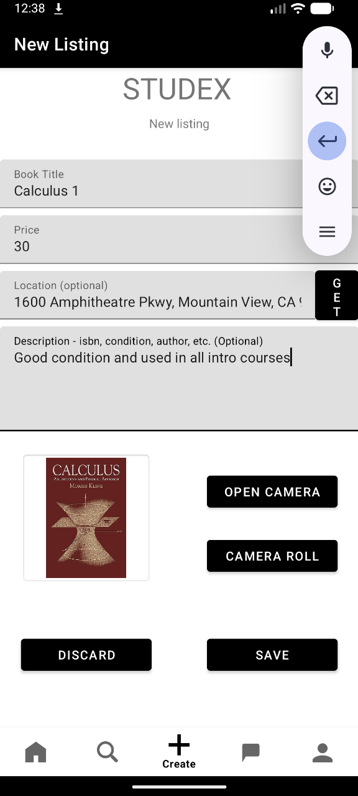
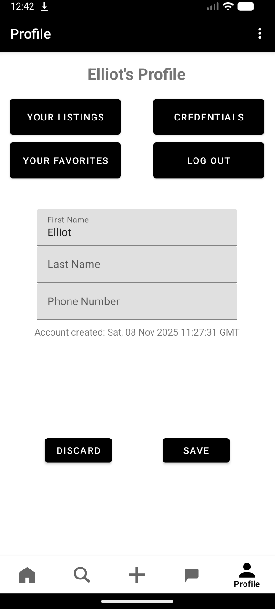

# Studex

An Android marketplace app for buying and selling university literature.  
The app features a full Java-based Android frontend and a Flask + SQLAlchemy Python backend with SQLite. Users can browse listings, chat with sellers, and manage their own items seamlessly.

  

## Preview




## Features
- Create an account and log in securely with JWT authentication
- Create listings with automatic geolocation
- Access phone camera or camera roll to upload images
- Browse listings with sections for recommended and recent items
- Chat with listing creators in real-time
- Like and search listings
- View all chats, liked listings, and your own listings
- Manage account details (name, password, etc.)
- Custom app logo and modern navigation using bottom menu and fragments

## Tech Stack
**Frontend (Android)**
- Java
- Android Studio
- Navigation component with bottom menu
- Fragments for UI pages
- Volley for HTTP requests
- Safeargs for arguments between fragments

**Backend (Python)**
- Flask
- SQLAlchemy, Flask-SQLAlchemy
- SQLite (local) / PostgreSQL (Azure deployment)
- Flask
- JWT authentication with `flask_jwt_extended`
- Password hashing with `flask_bcrypt`
- Unit tests for HTTP endpoints

## How to run
```bash
# 1) Clone the repository
git clone git@github.com:Puffen8/studex.git
cd studex-android-app/tddd80-projekt-2023-u1-sg5-02
```

### Backend
```bash
# 1) Install dependencies
pip install -r requirements.txt

# 2) Run Flask server
python app.py
```

### Frontend
```bash
# 1) Download Android Studio (Hedgehog) from
https://developer.android.com/studio/archive

# 2) Start Android Studio, open the folder and run the app on an emulator of desired Android phone

